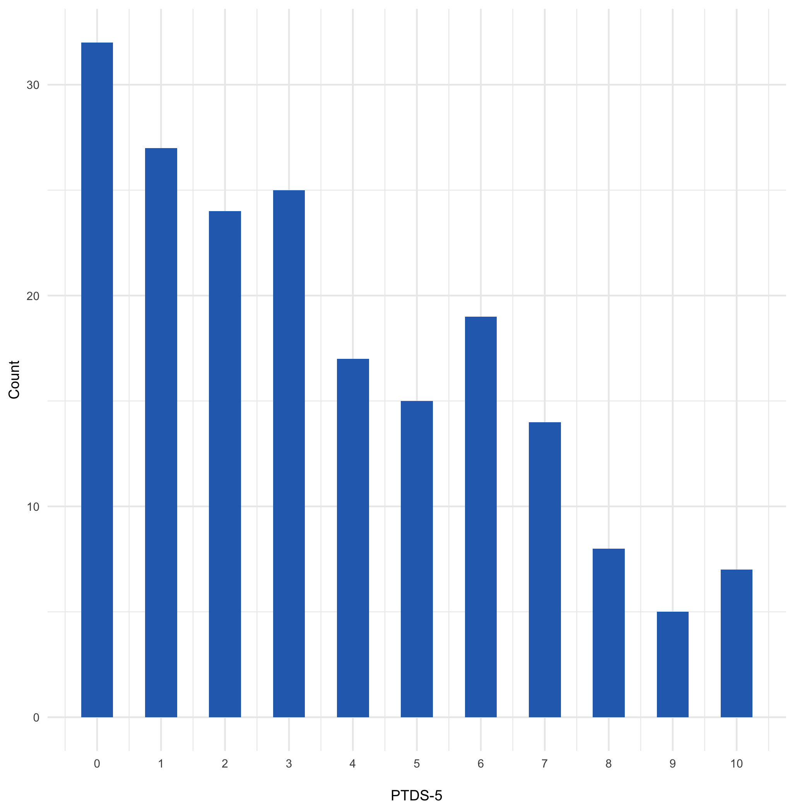
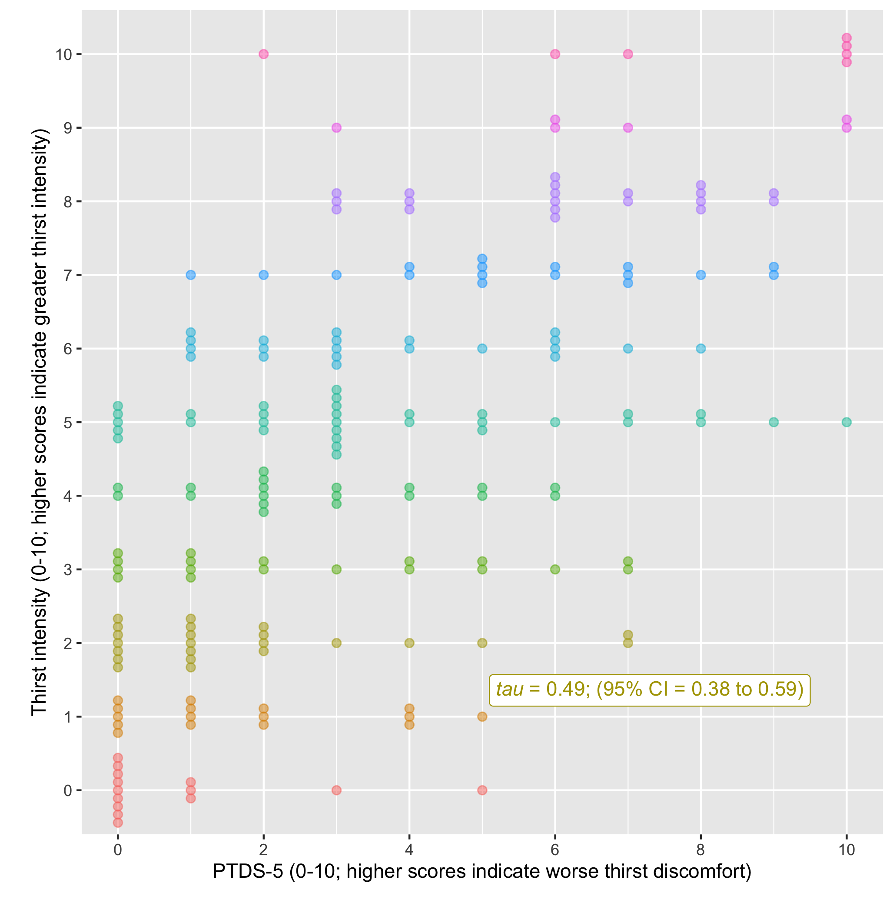
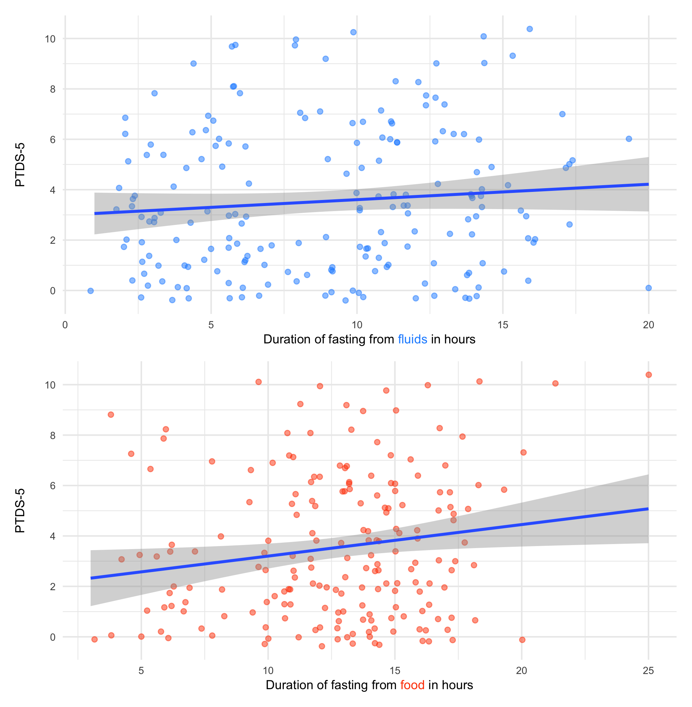

```{r global_options, include=FALSE}
knitr::opts_chunk$set(echo=FALSE, warning=FALSE, message=FALSE, fig.retina = 5)
# tint options
library(tint)
knitr::opts_chunk$set(tidy = FALSE, cache.extra = packageVersion('tint'))
options(htmltools.dir.version = FALSE)
library(drake)
library(magrittr)
library(flextable)

food  <-  glue::glue("{round(mean(drake::readd(data_ptds)$food_duration, na.rm=T), 1)} (SD {round(sd(drake::readd(data_ptds)$food_duration, na.rm=T), 1)})")
fluids  <-  glue::glue("{round(mean(drake::readd(data_ptds)$fluids_duration, na.rm=T), 1)} (SD {round(sd(drake::readd(data_ptds)$fluids_duration, na.rm=T), 1)})")
ptds5 <-  glue::glue("{round(median(drake::readd(data_ptds)$ptds, na.rm=T), 1)} (IQR {quantile(drake::readd(data_ptds)$ptds, 0.25)}, {quantile(drake::readd(data_ptds)$ptds, 0.75)})")
drake::loadd(global_thirst_corr)
drake::loadd(intensity_corr)

```

\pagebreak

## Abstract

### Introduction

Thirst discomfort is common because patients are required to undergo long periods of fasting before medical and surgical procedures. The aim of this study was to examine the validity and reliability of the perioperative thirst discomfort scale (PTDS) for measuring thirst discomfort before procedures.

### Methods

Fasting patients who were scheduled for an elective cardiac or interventional radiology procedure were included in a prospective observational study. Mokken scaling analysis was used to investigate the dimensionality and hierarchical nature of the PTDS. PTDS score were compated with fasting duration to evaluate construct validity and convergent validity was evaluated by comparing scpre with global thirst discomfort and thirst intensity ratings.

### Results

Five items from the perioperative thirst discomfort scale (PTDS-5) formed a Mokken scale with evidence of invariant item ordering. Participants most easily endorsed the item related to the desire to drink water through to first endorsing symptoms related to dryness of the mouth and lips before those related to the abnormal sensations of 'thick' saliva and a 'thick' tongue. Scale reliability was adequate (*rho* =`r drake::readd(reliability_ptds5)`). There was a positive correlation between PTDS-5 scores and the global thirst discomfort rating (*tau* = `r round(global_thirst_corr$tau, 2)`; 95% CI = `r round(global_thirst_corr$CI_low, 2)` to `r round(global_thirst_corr$CI_high, 2)`), as well as thirst intensity (*tau* = `r round(intensity_corr$tau, 2)`; 95% CI = `r round(intensity_corr$CI_low, 2)` to `r round(intensity_corr$CI_high, 2)`). Duration of fasting was not associated with PTDS-5 scores.

### Conclusion

The items in the PTDS-5 form a strong Mokken scale, meaning it is a reliable and precise way to order patients according to their thirst discomfort.

Keywords: fasting, aspiration, patient safety, thirst, anesthesia, nursing, Mokken scale, scale development, item response theory

\pagebreak

## Declarations

Availability of data and material (data transparency): All data used is available [here](https://github.com/awconway/ptds).

Code availability: Code to reproduce the analyses is available [here](https://github.com/awconway/ptds)<!-- and is archived [here]()-->.

Abbreviated title: Perioperative thirst discomfort scale

Funding statement: Support was provided solely from institutional and/or departmental sources. MP is supported by an Early Investigator Merit Award from the Department of Anesthesia, University of Toronto and Toronto General Hospital.

Conflicts of interest: The authors declare no competing interests.

Author contributions: AC: Study design, data analysis and wrote manuscript; KC: Study design, revised the manuscript for important intellectual content; MB: Data collection, revised the manuscript for important intellectual content; DP: Data collection, revised the manuscript for important intellectual content; NK: Study design, revised the manuscript for important intellectual content; AM: Study design, revised the manuscript for important intellectual content; MP: Study design, revised the manuscript for important intellectual content; SM: Study design, revised the manuscript for important intellectual content; SM: Study design, revised the manuscript for important intellectual content; PG: Study design, revised the manuscript for important intellectual content; SA: Study design, revised the manuscript for important intellectual content.

\pagebreak

## Introduction

Pre-procedure fasting is used to reduce the risk of vomiting and aspiration pneumonia during sedation and general anaesthesia, or in case emergency intubation is required due to unexpected cardiac arrest.[@hamid2014pre; @osborne2002preoperative] However, prolonged fluid restriction causes thirst symptoms to develop (e.g., dry mouth, swollen tongue), which can lead to great discomfort.[@madsen1998perioperative] Current guidelines related to pre-procedure fasting for elective procedures recommend a minimum fasting period of 2 hours nil-per-os (NPO) for clear fluids.[@dobsonGuidelinesPracticeAnesthesia2018] Despite these recommendations, current practice is for patients undergoing surgical and other medical procedures that require sedation or anesthesia to receive standardized 'nil-by-mouth' fasting instructions at a pre-specified time interval before procedures. For example, 'no eating or drinking after midnight' is most common. This 'standardized' instruction will not be changed regardless of whether or not there are alterations in scheduling throughout the day that result in significant delays in procedure start time. As a result, fasting durations far exceed the recommended requirement for most patients undergoing medical and surgical procedures.[@de2014actual; @sorita2015frequency; @spitz2017impact] For example, in a recent study of 3641 fasting orders at a large academic institution in the USA, it was found that the median fasting duration was 12.8 hours, averaging 2 missed meals.[@sorita2015frequency]

As a direct result of prolonged pre-procedure fasting, symptoms of thirst discomfort have been reported as common and severe. In a qualitative study where 12 participants were interviewed from a tertiary hospital in Australia, surgical patients and patients who adhered to prolonged fasting instructions described the discomfort from thirst symptoms to be the worst physical effect of fasting.[@carey2015qualitative] Similarly, Madsen et al. interviewed a convenience sample of 50 adult surgical patients who reported that thirst symptoms caused more discomfort than hunger, sleep, or anxiety related to the procedure.[@madsen1998perioperative] However, thirst and its symptoms continue to be undervalued, under-reported and infrequently assessed by health care providers, including the nursing team.[@milani2016thirst]

Despite the relevance and value of assessing thirst-discomfort of patients, the subjective experience of thirst presents challenges in developing a valid and reliable tool to succinctly and accurately measure its symptoms and level of discomfort prior to procedures. A thirst-discomfort scale for perioperative use was developed at a surgical centre affiliated with an accredited public hospital in Brazil.[@Martins_2017] The seven-item perioperative thirst-discomfort scale (PTDS) was developed in three stages, including face and content validation and reliability, and based on the Consensus-based Standards for the selection of health status Measurement Instruments (COSMIN) checklist.[@mokkink2010cosmin] Inter-rater reliability was tested through inter-observer equivalence where a pair of nurses independently, but simultaneously administered the scale among 70 patients. Six items on the scale had a weighted kappa coefficient of 1, while the item "I feel like drinking water" was 0.97.[@Martins_2017] Cronbach's alpha was used to test the internal consistency of the scale with a value of 0.91.[@Martins_2017]

Although the initial validation of the PTDS was conducted in a different context (i.e. *post*-surgical patients), it demonstrates strong potential for accurately assessing thirst-discomfort more generally for peri-operative use. The aim of this study was to examine the validity and reliability of the PTDS for measuring thirst discomfort for patients who are fasting *before* medical procedures.

## Methods

### Study Design

This study used a prospective, observational design. No changes to usual clinical practice were made for this study in regard to pre-procedure fasting. Patients who were scheduled for a morning procedure were typically asked to remain nil-per-os (NPO) from midnight. Patients with afternoon procedures can have a small breakfast but must remain NPO from 6:00am on the day of the procedure. Ethical approval for this study (Ethical Committee N° 19-5585) was provided by the University Health Network Research Ethics Board, Toronto, Canada on October 31 2019.

### Participants

#### Inclusion criteria

Adult patients who were fasted and scheduled for an elective procedure in the Cardiac Catheterization Laboratories or in Interventional Radiology at an academic teaching hospital in Canada were included.

#### Exclusion criteria

1.  Under 16 years of age
2.  Undergoing an emergency procedure
3.  Unable to understand or speak English and a translator is not immediately available
4.  Nurse in pre-procedural bay considered that there was insufficient time prior to anticipated commencement of the procedure for participation in the study.

### Data collection

A Research Assistant administered a brief questionnaire prior to procedures. It comprised the following components:

-   the Perioperative Thirst Discomfort Scale (7 items);
-   a one-item global thirst discomfort rating;
-   a one-item thirst intensity rating;
-   an item to determine if the participant is currently on oxygen therapy;
-   an item to evaluate the presence of pain;
-   the time the patient last had any clear fluids;
-   the time the patient last had any food;
-   age, sex of patient and type of procedure to be performed.

#### Measures

The seven-item Perioperative Thirst Discomfort Scale (PTDS-7) is a 7-item self-reported, composite score evaluating the severity of dry mouth, lips, and throat, thick tongue and saliva, a bad taste in the mouth, and a desire to drink water. The total score can range from 0 to 14, with 14 representing the "most extreme" intensity of discomfort related to perioperative thirst. This instrument was developed and validated for perioperative use in a surgical centre at a public hospital in Brazil. Face validation was conducted by group consisting of nurses with PhDs, new graduate nurses, and patients. Content validation was conducted by a team consisting of specialists with perioperative nursing experience related to thirst or instrument validation. The reliability of the scale was assessed through inter-observer equivalence by a research nurse and a staff nurse from the Post Anesthesia Care Unit among 70 patients pre and postoperatively in an anesthetic recovery room. The Cronbach alpha score was 0.91. The time taken to complete the PTDS-7 was not evaluated.

Participants used a global thirst discomfort score to rate their overall level of thirst discomfort on a rating scale with scores ranging from "extreme thirst discomfort" to "extreme comfort". Intensity of their thirst was rated on a scale ranging from 0 to 10, where 0 represents "No thirst" and 10 represents "Most intense thirst". The experience of pain may influence the participant's perception of thirst.[@Pierotti_2018] Participants were asked to rate their current level of pain on a scale of 0 to 10, where 0 represents "no pain" and 10 represents that their pain as "unimaginable/unspeakable". The use of oxygen therapy (e.g., via nasal prongs) may contribute to the experience of thirst symptoms (e.g., dry mouth, dry throat).[@conchon2015perioperative] The research assistant recorded "yes" or "no" as to whether the participant was currently receiving oxygen therapy at the time the questionnaire was administered.

### Statistical analysis

Mokken scaling is a method for establishing if items in a scale conform to a cumulative, hierarchical structure.[@perng2012construct] When an instrument contains hierarchically ordered items, the items can be ordered from those indicating mild to severe symptoms. An intentionally simple example of a hierarchical scale is a set of items enquiring about height that increases in increments of 10cm from 100cm to 200cm. In this example, taller people would endorse more items than those who were shorter.[@watson2008hierarchy]

To determine if items conform to a hierarchical structure, Mokken scaling analyses properties of individual items as described by the item characteristic curve. Item characteristic curves show the association between the score on an item to the level of the latent trait being measured. Mokken scaling makes only the assumption of monotone homogeneity about the association between the score on an item and the level of the latent trait. This means that as the trait increases, so does the item score. "Difficulty", is a term used in Mokken Scale Analysis to refer to the extent to which items are endorsed by respondents. Items at the upper end of the range of the latent trait are characterized as being more difficult. Items in a Mokken Scale are arranged along the latent trait in terms of their difficulty. The properties of items can be measured using the scalability coefficient, *H* (Loevinger's coefficient). *H* measures the extent to which items are arranged as expected by their mean values along the latent trait. *H* \> 0.3 is the minimum acceptable value, with values \> 0.4 indicating a moderate scale and \> 0.5 indicates a strong scale.

Invariant item ordering, where the order of items along the latent trait is the same for all respondents at all levels of the latent trait, is a desirable property of a Mokken Scale. It can be assessed mathematically to look for significant violations of this property. The accuracy of the invariant item ordering can also be assessed by calculating the *H~TRANS~* (**H~T~**) coefficient. Values of **H~T~** exceeding 0.3 indicates acceptable accuracy of invariant item ordering.

Mokken scale analysis was conducted in this study to explore whether there were hierarchical properties in participant ratings of thirst discomfort and to explore the dimensions of the PTDS. Mokken scale analysis proceeded by first checking the PTDS-7 scalability coefficients. If **H~i~** was below 0.3 or if the lower limit of the 95% CI (confidence interval) for *H~i~* was below 0.3, the item was to be excluded. Then, scale partitioning was carried out to explore the dimensions of the PTDS through increasing c (lower bound c defines the minimum value of coefficients **H~i~** in the Mokken scale by 0.05 increments).[@molenaar2000mps5] Monotone homogeneity and invariant item ordering were investigated at the whole scale level, as no sub-scales were identified. To assess for violations of invariant item ordering, crit values \<40 were considered acceptable.[@molenaar2000mps5] Provided invariant item ordering holds for a set of items, the coefficient **H~T~** expresses the accuracy of the ordering, with values below 0.3 being unacceptable and above 0.4 indicating moderate invariant item ordering.[@Ligtvoet_2010] The coefficient score (rho), which is similar to Cronbach's alpha, was used to assess reliability of the scale.

Construct validity was evaluated by using correlations to identify associations between scores on the PTDS and fasting duration. To investigate construct validity we hypothesized that higher scores on the PTDS would be associated with greater fasting duration. Convergent validity was assessed by using Kendall's *tau* to compare the PTDS score with the global thirst discomfort score. Convergent validity was assessed by using the Spearman's rank correlation to compare the PTDS with the thirst intensity rating and pain scale rating.

## Results

From November 2019 to March 2020, we screened 203 patients for inclusion in the study. A total of 198 were eligible and 194 participated. One participant did not complete 1 of the PTDS-7 items and was excluded from the analysis. A summary of participant characteristics is displayed in Table \@ref(tab:tab1). The median age was 62 (IQR 48 - 72) and 58% (n=111) were female. 43% of patients were scheduled to have their procedure in the cardiac catheterization laboratory. A biopsy was the most common interventional radiology procedure (n=62; 32%), but a wide range of other procedures were included. The mean duration of fasting from food and non-clear fluids was `r food` hours and clear fluids was `r fluids` hours.

### Mokken scale analysis

No items required removal from the PTDS-7 based on the condition that scalability coefficients (*H~i~* and lower bound of 95% CI) should be over 0.3 (Appendix Table \@ref(tab:Hvaluesptds7)). We used a lower bound for *c*, starting from 0.05 and increasing to 0.80 in 0.05 increments, to explore the dimensionality of the PTDS-7. From 0.05 to 0.45, all of the items formed a single scale. The item, '*I have a bad taste in my mouth*', was excluded by selecting the remaining items which showed uni-dimensionality at a threshold level of .50. The 6 remaining items (PTDS-6) were further examined for the criteria of a Mokken scale and item invariant ordering. The PTDS-6 item set has a homogeneity value *H(se)* of `r readd(H_values_ptds6)$H`, which indicated a strong Mokken scale. Results indicated that there were no significant violations of the assumption of monotonicity (z-sig). As such, no items were removed based on this criteria.

#### Invariant item ordering

Analysis of invariant item ordering for the PTDS-6 revealed violations for the dry throat/dry lips item pair (Appendix Table \@ref(tab:iioptds6)). Although there were no *significant* intersections between items, due to the intersection between the dry throat and dry lips items, crit values were above 40. For this reason, we excluded one of these items (dry throat), and re-assessed the remaining 5 items for the assumptions of a Mokken scale. With the dry throat item removed, none of the items violated the assumption of invariant item ordering (Appendix Table \@ref(tab:iioptds5)).

#### Accuracy and reliability

The accuracy of the item ordering was found to be acceptable with a *H~T~* coefficient of `r drake::readd(accuracy_ptds5)`. Scale reliability was adequate with a coefficient score (Rho) of `r drake::readd(reliability_ptds5)`.

#### Item difficulty hierarchy

The item difficult hierarchy for the PTDS-5 is presented in Table \@ref(tab:tab2). The most highly endorsed symptom (i.e. the least severe symptom of thirst discomfort in the PTDS-5) was being bothered by a desire to drink water. The least endorsed symptom (i.e. the most severe symptom of thirst discomfort in the PTDS-5) was being bothered by the perception of a 'thick tongue'. The items in the PTDS-5 form a strong Mokken scale (H~s~ = `r drake::readd(H_values_ptds5)$H[1]`).

### Construct and convergent validity

The median PTDS-5 score was `r ptds5`. The distribution of PTDS-5 scores was right-skewed (Figure \@ref(fig:distribution)). There was a positive correlation between PTDS-5 scores and thirst intensity (Figure \@ref(fig:intensity)), as well as the global thirst discomfort rating (Figure \@ref(fig:globalthirst)). The associations between PTDS-5 scores with food and fluid duration is displayed in Figure \@ref(fig:fasting). Longer duration of fasting was not linearly associated with PTDS-5 scores. Likewise, the correlation between pain and PTDS-5 scores was not significant (Spearman's rho = `r round(drake::readd(pain_corr)$rho, 2)`; 95% CI = `r round(drake::readd(pain_corr)$CI_low, 2)` to `r round(drake::readd(pain_corr)$CI_high, 2)`).

## Discussion

Results indicate that the PTDS-5 is a reliable and precise way to order patients according to their thirst discomfort in the *pre-procedure* period. In addition, an acceptable accuracy for invariant item ordering was identified, meaning patients are likely to rank the PTDS-5 symptoms of thirst discomfort in the same way. As such, the item difficulty hierarchy, presented in Table \@ref(tab:tab2) can be used as a guide to easily determine which patients are expriencing worse thirst discomfort. The hierarchical pattern of responses to items in the Mokken scale is interpretable in terms of respondents more easily endorsing items related to a general desire to drink water through to first endorsing more specific symptoms related to dryness of the mouth and lips prior to endorsing discomfort associated with the sensations of 'thick' saliva and 'thick' tongue. In more practical terms, a patient who reports feeling bothered by a sensation that saliva is thick, could be interpreted as experiencing worse thirst discomfort than a patient who did not endorse any of the items lower down on the item difficulty hierarchy (i.e. 'my lips are dry' and 'my mouth is dry').

The original (7-item) perioperative thirst-discomfort scale has previously been used to determine the relationship between thirst intensity and thirst-discomfort in the immediate postoperative period during anesthesia recovery.[@Pierotti_2018] In a non-probabilistic sample of 203 adult participants in post-operative recovery following elective, urgent and emergency surgeries, the investigators found no association between fasting duration, or patient age, and the intensity of thirst and degree of discomfort.[@Pierotti_2018] However, the mean fasting duration among participants was uniformly high (mean 16.2 [SD 8.7] hours), which may have prevented the researchers from discerning a correlation between fasting duration. Even in the subgroup of participant who reported 8 hours of fasting, all reported thirst.[@aroni2012assessment; @Pierotti_2018]

It should be noted that an investigation of the dimensionality of the 7-item PTDS had not been performed prior to our study. A uni-dimensional solution was identified in our analysis. This should be expected considering the small number of items that were evaluated.

We did not observe an association between PTDS-5 and fasting duration for either food or fluids. This would suggest that it is important to assess thirst discomfort periodically, regardless of the duration of fasting. If thirst discomfort is present, and fasting is still indicated, interventions to alleviate symptoms should be implemented. There is a lack of evidence regarding the efficacy of any such interventions.

### Limitations

Selection bias should be considered because a convenience sample was used for this study. Also, it is uncertain if similar results would be obtained for patients who are fasted prior to undergoing procedures in other settings. Only one patient was excluded from the analysis due to missing data, so it is unlikely attrition bias would have exerted a major influence on the results. Further research is required to evaluate the minimal detectable difference for the PTDS-5 as well as the minimal clinically important difference prior to use of this scale as an outcome measure in research.

### Conclusion

The items in the PTDS-5 form a reliable and precise way to order patients according to their thirst discomfort. Nurses may use this scale to assess the severity of thirst discomfort in patients who are fasted prior to procedures and initiate interventions according to individual needs.

\pagebreak

## References

::: {#refs}
:::

\pagebreak

## Figure legend

Fig. \@ref(fig:distribution) Distribution of PTDS-5 scores

Fig. \@ref(fig:intensity) Association between PTDS-5 and thirst intensity

Fig. \@ref(fig:globalthirst) Association between PTDS-5 and global thirst rating

Fig. \@ref(fig:fasting) Association between PTDS-5 and duration of fasting

\pagebreak

```{r tab.cap="Participant characteristics", tab.id = 'tab1'}
drake::loadd(summary_table)
# gtsummary::as_flextable(summary_table)
gtsummary::as_kable_extra(summary_table, booktabs = T)
```

\pagebreak

```{r tab.id = "tab2", tab.cap= "Item hierarchy of the PTDS-5"}
# flextable::flextable(drake::readd(item_hierarchy_df_ptds5)) %>% 
#   autofit()
drake::readd(item_hierarchy_df_ptds5) %>% 
  kableExtra::kable(booktabs = T)
```

<!---BLOCK_MULTICOL_START--->

<!---BLOCK_STOP--->

<!--BLOCK_LANDSCAPE_START--->

```{r distribution, fig.cap = "Distribution of PTDS-5 scores"}
# 
drake::readd(distribution_plot)
```

\pagebreak

```{r intensity, fig.cap="Association between PTDS-5 and thirst intensity. PTDS-5 score ranges from 0 to 10 with higher scores indicating worse thirst discomfort."}
# 
drake::readd(thirst_intensity_plot)
```

\pagebreak

```{r globalthirst, fig.cap="Association between PTDS-5 and global thirst rating"}
# knitr::include_graphics("figures/global-thirst.png")
library(dplyr)
drake::readd(global_thirst_plot)
```

\pagebreak

```{r fasting, fig.cap = "Association between PTDS-5 and duration of fasting"}
# 
drake::readd(fasting_duration_ptds_plot)
```

\pagebreak

## Appendix

```{r tab.id='Hvaluesptds7', tab.cap.pre="Appendix Table ", tab.cap = "Homogeneity values (and standard errors) for all items in the PTDS"}
drake::readd(H_values_ptds7_table) %>% 
  # flextable::flextable() %>% 
  # autofit()
  kableExtra::kable(booktabs = T)
```

\pagebreak

```{r tab.id='monotonicity', tab.cap.pre="Appendix Table ", tab.cap="monotonicity with default minsize"}

# flextable::flextable(drake::readd(monotonicity_df_ptds6_table)) %>%  
#   autofit()
 drake::readd(monotonicity_df_ptds6_table) %>% 
kableExtra::kable(booktabs = T)
```

\pagebreak

```{r tab.id='aisp', tab.cap.pre="Appendix Table ", tab.cap = "aisp for increasing H thresholds (*c*)"}
# flextable::flextable(drake::readd(aisp)) %>% 
  # autofit()
drake::readd(aisp) %>% 
  kableExtra::kable(booktabs = T)
```

\pagebreak

```{r tab.id='iioptds6', tab.cap.pre="Appendix Table ", tab.cap = "Invariant item ordering for PTDS-6"}
drake::readd(iio_ptds6_table) %>% 
  # flextable() %>% 
  # autofit()
  kableExtra::kable(booktabs = T)
```

\pagebreak

```{r tab.id='iioptds5', tab.cap.pre="Appendix Table ", tab.cap = "Invariant item ordering for PTDS-5"}
drake::readd(iio_ptds5_table) %>%
    # flextable() %>%
    # autofit()
  kableExtra::kable(booktabs = T)
```

<!---BLOCK_LANDSCAPE_STOP--->
